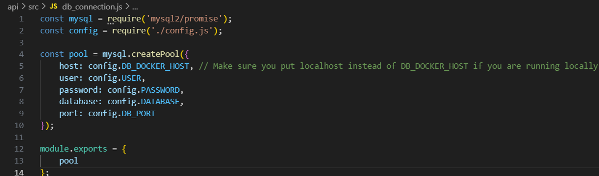

# Movicious

Movicious is a web application that allows users to rate movies and get recommendations based on their preferences.

# Project Architecture


# Entity-Relationship Diagram (ERD)


# Setting Up the Project

# Locally

## Clone the repository:
- git clone <repository-url>
- cd api
## Install dependencies:
- npm i
- Do the same but for the AI service just go to the ai-service (cd .. then cd ai-service) folder and run npm i
## Create a .env file in the root directory with the following environment variables:
```	
HOST=localhost
USER=root
PASSWORD= 
DATABASE=movicious
PORT=3001
PORT_AI_SERVICE=3002
DB_PORT=3306
DB_DOCKER_HOST=mysqldb
AI_DOCKER_HOST=ai-service

API_KEY_AUTH=
ACCESS_TOKEN_AUTH=
OPENAI_API_KEY= 
```

## Ensure MySQL is configured (e.g., XAMPP, AMPPS, etc.).
## Also add manually the following tables to the database:
```	
USE movicious;

CREATE TABLE Users (
    id INT AUTO_INCREMENT PRIMARY KEY,
    username VARCHAR(50) NOT NULL UNIQUE,
    email VARCHAR(100) NOT NULL UNIQUE,
    password VARCHAR(255) NOT NULL,
    created_at TIMESTAMP DEFAULT CURRENT_TIMESTAMP
);

CREATE TABLE Ranks (
    id INT AUTO_INCREMENT PRIMARY KEY,
    user_id INT NOT NULL,
    tmdb_id INT NOT NULL,
    ranking INT NOT NULL,
    created_at TIMESTAMP DEFAULT CURRENT_TIMESTAMP,
    FOREIGN KEY (user_id) REFERENCES Users(id),
    UNIQUE (user_id, tmdb_id)
);
```

## Before running the project, apply this changes:
- In movicious\api\src\db_connection.js change the DB_DOCKER_HOST to HOST

- In movicious\api\src\controllers\ai.controllers.js change the AI_DOCKER_HOST to localhost


## Run the project:
- cd api
```
npm start
```
 # If you are running the project in docker
 - cd movicious
 - run the following command (make sure that your ports are available):
```
docker compose up --build 
```
This will start up 3 microservices (api, ai-service and mysql). So you don't need to run the previous steps.

# Final step 
To view this project, you have two options:

1. **Open the `index.html` file directly in your browser:**

   - Navigate to the project directory.
   - Locate the `index.html` file.
   - Double-click on the file to open it in your default web browser.

2. **Use the "Live Server" extension in VS Code:**

   - Open the project directory in Visual Studio Code.
   - Install the "Live Server" extension if you haven't already. You can do this by:
     - Going to the Extensions view by clicking on the Extensions icon in the Sidebar or pressing `Ctrl+Shift+X`.
     - Searching for "Live Server" and clicking "Install".
   - After installing the extension, right-click on the `index.html` file and select "Open with Live Server".
   - Your default browser will automatically open and display the project.

# Tests
- cd api
- run the following command to run the tests
```
npm test
```	
- You should see the following output:


